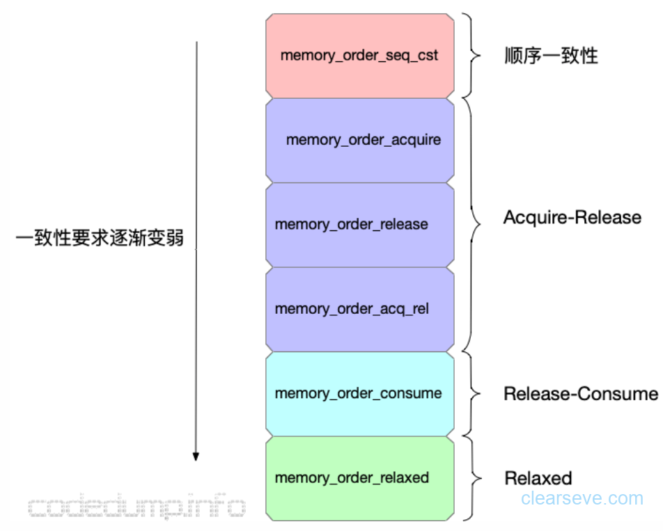
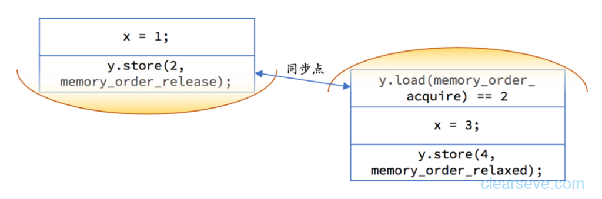

# 线程
c++11后的线程库是<thread>,不需要使用老的<pthread>

## 构造函数
* thread() noexcept：默认构造函数，创建一个空的thread执行对象；
* explicit thread(Fn&&fn, Args&&...args)：初始化构造函数，创建一个带函数调用参数的thread，这个线程是可joinable的；
* thread(const thread&) = delete：拷贝构造函数被禁用，意味着thread对象不可拷贝构造；
* thread(thread&& x) noexcept：移动构造函数，调用成功之后，x不代表任何thread执行对象；

## 生命周期
* join()是等待子线程执行完成之后，主线程才继续执行，此时主线程会释放掉执行完成后的子线程的资源。
* detach()将子线程从主线程中分离出来，这样主线程就对子线程没有控制权了，子线程执行完成后会自己释放掉资源。

linux上编译需要加上 -pthread,window,mac上不用

	#include <iostream>
	#include <thread>
	#include <string>
	#include <chrono>
	
	using namespace std;
	
	void thread_one()
	{
	    puts("hello");
	}
	
	void thread_two(int num, string& str)
	{
	    cout << "num:" << num << ",name:" << str << endl;
	}
	void f1(int n)
	{
	    for (int i = 0; i < 5; ++i)
	    {
		cout << "=====Thread:" << n << "======" << endl;
		this_thread::sleep_for(chrono::microseconds(10));
	    }
	}
	
	void f2(int& n)
	{
	    for (int i = 0; i < 5; ++i)
	    {
		cout << "thread two executing" << endl;
		++n;
		this_thread::sleep_for(chrono::microseconds(10));
	    }
	}
	int main(int argc, char* argv[])
	{
	    thread tt(thread_one);
	    tt.join();
	    string str = "luckin";
	    thread yy(thread_two, 88, ref(str));   //这里要注意是以引用的方式调用参数
	    yy.detach();
	
	    int n = 0;
	    thread t1;    //这是一个空的线程对象，还不是一个线程
	    thread t2(f1, n + 1);
	    thread t3(f2, ref(n));
	    thread t4(move(t3));    //t3不再是一个线程
	    t2.join();
	    t4.join();
	    cout << "the result n is:" << n << endl;
	    system("pause");
	    return 0;
	}

## 多线程开发
### mutex互斥量
* lock：锁定，锁已经被其他线程获得时则阻塞执行
* try_lock：尝试锁定，获得锁返回 true，在锁被其他线程获得时返回 false
* unlock：解除锁定（只允许在已获得锁时调用）

	#include <chrono>
	#include <iostream>
	#include <mutex>
	#include <thread>
	
	using namespace std;
	
	mutex output_lock;
	
	void func(const char* name)
	{
	  this_thread::sleep_for(100ms);
	  lock_guard<mutex> guard{
	    output_lock};
	  cout << "I am thread " << name
	       << '\n';
	}
	
	
	class scoped_thread {
	public:
	  template <typename... Arg>
	  scoped_thread(Arg&&... arg)
	    : thread_(
	        std::forward<Arg>(arg)...)
	  {}
	  scoped_thread(
	    scoped_thread&& other)
	    : thread_(
	        std::move(other.thread_))
	  {}
	  scoped_thread(
	    const scoped_thread&) = delete;
	  ~scoped_thread()
	  {
	    if (thread_.joinable()) {
	      thread_.join();
	    }
	  }
	
	private:
	  thread thread_;
	};
	
	
	
	int main()
	{
	  scoped_thread t1{func, "A"};
	  scoped_thread t2{func, "B"};
	}

### 其他互斥量
* recursive_mutex：在同一线程对同一个互斥量多次加锁 
* timed_mutex：允许锁定超时的互斥量
* recursive_timed_mutex：允许锁定超时的递归互斥量
* shared_mutex：允许共享和独占两种获得方式的互斥量
* shared_timed_mutex：允许共享和独占两种获得方式的、允许锁定超时的互斥量

### condition_variable 条件变量

	#include <chrono>
	#include <condition_variable>
	#include <functional>
	#include <iostream>
	#include <mutex>
	#include <thread>
	#include <utility>
	
	using namespace std;
	
	class scoped_thread {
	public:
	  template <typename... Arg>
	  scoped_thread(Arg&&... arg)
	    : thread_(
	        std::forward<Arg>(arg)...)
	  {}
	  scoped_thread(
	    scoped_thread&& other)
	    : thread_(
	        std::move(other.thread_))
	  {}
	  scoped_thread(
	    const scoped_thread&) = delete;
	  ~scoped_thread()
	  {
	    if (thread_.joinable()) {
	      thread_.join();
	    }
	  }
	
	private:
	  thread thread_;
	};
	
	void work(condition_variable& cv,
	          int& result)
	{
	  // 假装我们计算了很久
	  this_thread::sleep_for(2s);
	  result = 42;
	  cv.notify_one();
	}
	
	int main()
	{
	  condition_variable cv;
	  mutex cv_mut;
	  int result;
	
	  scoped_thread th{work, ref(cv),
	                   ref(result)};
	  // 干一些其他事
	  cout << "I am waiting now\n";
	  unique_lock lock{cv_mut};
	  cv.wait(lock);
	  cout << "Answer: " << result
	       << '\n';
	}

### future

一个 future 上只能调用一次 get 函数，第二次调用为未定义行为，通常导致程序崩溃（对于值类型的结果，get 会以移动的方式来返回）。这样一来，自然一个 future 是不能直接在多个线程里用的。

	#include <chrono>
	#include <future>
	#include <iostream>
	#include <thread>
	
	using namespace std;
	
	int work()
	{
	  // 假装我们计算了很久
	  this_thread::sleep_for(2s);
	  return 42;
	}
	
	int main()
	{
	  auto fut = async(launch::async, work);
	  // 干一些其他事
	  cout << "I am waiting now\n";
	  cout << "Answer: " << fut.get()
	       << '\n';
	}

### promise
promise 和 future 在这里成对出现，可以看作是一个一次性管道：有人需要兑现承诺，往 promise 里放东西（set_value）；有人就像收期货一样，到时间去 future就行了。我们把 prom 移动给新线程，这样老线程就完全不需要管理它的生命周期了。

	#include <chrono>
	#include <future>
	#include <iostream>
	#include <thread>
	#include <utility>
	
	using namespace std;
	
	class scoped_thread {
	public:
	  template <typename... Arg>
	  scoped_thread(Arg&&... arg)
	    : thread_(
	        std::forward<Arg>(arg)...)
	  {}
	  scoped_thread(
	    scoped_thread&& other)
	    : thread_(
	        std::move(other.thread_))
	  {}
	  scoped_thread(
	    const scoped_thread&) = delete;
	  ~scoped_thread()
	  {
	    if (thread_.joinable()) {
	      thread_.join();
	    }
	  }
	
	private:
	  thread thread_;
	};
	
	void work(promise<int> prom)
	{
	  // 假装我们计算了很久
	  this_thread::sleep_for(2s);
	  prom.set_value(42);
	}
	
	int main()
	{
	  promise<int> prom;
	  auto fut = prom.get_future();
	  scoped_thread th{work,
	                   move(prom)};
	  // 干一些其他事
	  cout << "I am waiting now\n";
	  cout << "Answer: " << fut.get()
	       << '\n';
	}

### 原子atomic

C++11的内存模型共有6种，分四类。其中一致性的减弱会伴随着性能的增强。

Sequential Consistency
atomic默认的模型是顺序一致性的，这种模型对程序的执行结果有两个要求：

每个处理器的执行顺序和代码中的顺序一样。
所有处理器都只能看到一个单一的操作执行顺序。
这意味着将程序看做是一个简单的序列。如果对于一个原子变量的操作都是顺序一致的，那么多线程程序的行为就像是这些操作都以一种特定顺序被单线程程序执行。以单线程顺序执行的缺点就是效率低。

Acquire-Release
原子操作有三类：

读：在读取的过程中，读取位置的内容不会发生任何变动。
写：在写入的过程中，其他执行线程不会看到部分写入的结果。
读‐修改‐写：读取内存、修改数值、然后写回内存，整个操作的过程中间不会有其他写入操作插入，其他执行线程不会看到部分写入的结果。

下面是获得和释放操作具体的作用：
memory_order_acquire：获得操作，在读取某原子对象时，当前线程的任何后面的读写操作都不允许重排到这个操作的前面去，并且其他线程在对同一个原子对象释放之前的所有内存写入都在当前线程可见。

memory_order_release：释放操作，在写入某原子对象时，当前线程的任何前面的读写操作都不允许重排到这个操作的后面去，并且当前线程的所有内存写入都在对同一个原子对象进行获取的其他线程可见。

还有一种读‐修改‐写操作，使用memory_order_acq_rel，含义如下：
memory_order_acq_rel：获得释放操作，一个读‐修改‐写操作同时具有获得语义和释放语义，即它前后的任何读写操作都不允许重排，并且其他线程在对同一个原子对象释放之前的所有内存写入都在当前线程可见，当前线程的所有内存写入都在对同一个原子对象进行获取的其他线程可见.

	int x = 0;
	int y = 0;
	
	//另外的线程执行
	x = 1;
	y = 2;
	
	//另外的线程执行
	if (y == 2) {
	  x = 3;
	  y = 4;
	}

改成

	//另外的线程执行
	x = 1;
	y.store(2, memory_order_release);
	
	//另外的线程执行
	if (y.load(memory_order_acquire) ==
	    2) {
	  x = 3;
	  y.store(4, memory_order_relaxed);
	}

Relaxed
在这种模型下，load()和store()都要带上memory_order_relaxed参数。Relaxed ordering 仅仅保证load()和store()是原子操作，除此之外，不提供任何跨线程的同步，乱序执行依然有。上面Acquire-Release的示例进入条件后，由于不再需要同步了，对循环内部进行重排序不会影响结果，性能还高。

Release-Consume
Acquire-Release能保证不同线程之间的Synchronizes-With关系，这同时也约束到同一个线程中前后语句的执行顺序。
而Release-Consume只约束有明确的carry-a-dependency关系的语句的执行顺序，同一个线程中的其他语句的执行先后顺序并不受这个内存模型的影响。

C++ 只能让一些最基本的类型原子化，比如 atomic_int、atomic_long

	using atomic_bool = std::atomic<bool>;    // 原子化的bool
	using atomic_int  = std::atomic<int>;      // 原子化的int
	using atomic_long = std::atomic<long>;    // 原子化的long

除了模拟整数运算，原子变量还有一些特殊的原子操作，比如 store、load、fetch_add、fetch_sub、exchange、compare_exchange_weak/compare_exchange_strong，最后一组就是著名的 CAS（Compare And Swap）操作。而另一个同样著名的 TAS（Test And Set）操作，则需要用到一个特殊的原子类型 atomic_flag。它不是简单的 bool 特化（atomic），没有 store、load 的操作，只用来实现 TAS，保证绝对无锁。

	void case3()
	{
	    atomic_int  x {0};
	    atomic_long y {1000L};
	
	    assert(++x == 1);
	    y += 200;
	    assert(y < 2000);
	
	    static atomic_flag flag {false};
	    static atomic_int  n;
	
	    auto f = [&]()
	    {
	        auto value = flag.test_and_set();
	
	        if (value) {
	            cout << "flag has been set." << endl;
	        } else {
	            cout << "set flag by " <<
	                this_thread::get_id() << endl;
	        }
	
	        n += 100;
	
	        //using namespace std::chrono_literals;
	
	        this_thread::sleep_for(n.load() * 10ms);
	        cout << n << endl;
	
	    };
	
	    thread t1(f);
	    thread t2(f);
	
	    t1.join();
	    t2.join();
	}

### once_flag
要先声明一个 once_flag 类型的变量，最好是静态、全局的（线程可见），作为初始化的标志：

	static std::once_flag flag;        // 全局的初始化标志

然后调用专门的 call_once() 函数，以函数式编程的方式，传递这个标志和初始化函数。这样 C++ 就会保证，即使多个线程重入 call_once()，也只能有一个线程会成功运行初始化。

	void case1()
	{
	    static once_flag flag;
	
	    auto f = 
	    {
	        cout << "tid=" <<
	            this_thread::get_id() << endl;
	
	        std::call_once(flag,
	            {
	                cout << "only once" << endl;
	            }
	        );
	    };
	
	    thread t1(f);
	    thread t2(f);
	
	    t1.join();
	    t2.join();
	}

单例模式，使用once_flag

	class Singleton{
	private:
	    static Singleton* _ptr;
	    static once_flag _flag;
	    Singleton(){}
	    Singleton(const Singleton&) = delete;
	public:
	    static Singleton* getInstance(){
	        call_once(_flag, {
	            _ptr = new Singleton();
	        });
	        return _ptr;
	    }
	};
	Singleton* Singleton::_ptr = nullptr;
	once_flag _flag;

使用静态变量

	class Singleton{
	private:
	    Singleton(){}
	    Singleton(const Singleton&) = delete;
	public:
	    static Singleton* getInstance(){
	        static Singleton instance;
	        return &instance;
	    }
	};

### thread_local

	void case2()
	{
	    //static int n = 0;
	    thread_local int n = 0;
	
	    auto f = [&](int x)
	    {
	        n += x;
	
	        cout << n;
	        cout << ", tid=" <<
	            this_thread::get_id() << endl;
	    };
	
	    thread t1(f, 10);
	    thread t2(f, 20);
	
	    t1.join();
	    t2.join();
	}
