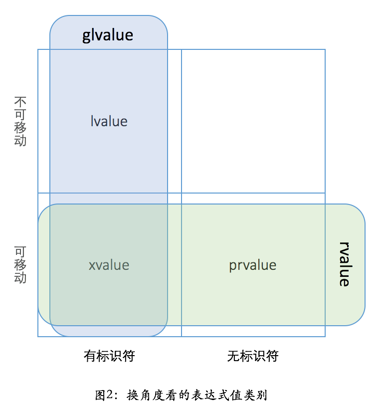

# 左值,右值
## 左值与右值

在C语言中，常常会提起左值（lvalue）、右值（rvalue）这样的称呼。而在编译程序时，编译器有时也会在报出的错误信息中包含左值、右值的说法。

### 左右值判别方法三

更为细致地，在C++11中，右值是由两个概念构成的，一个是纯右值（prvalue，Pure Rvalue），另一个则是将亡值（xvalue，eXpiring Value）。其中纯右值就是C++98标准中右值的概念，指的是用于辨识临时变量和一些不跟对象关联的值。比如：返回类型为非引用的函数返回的临时变量值就是一个纯右值。

* 一些运算表达式，比如1+3产生的临时变量值，也是纯右值。
* 而不跟对象关联的字面量值，比如：2、‘c’、true，也是纯右值。
* 此外，类型转换函数的返回值、lambda表达式等，也都是右值。

而将亡值则是C++11新增的跟右值引用相关的表达式，这样表达式通常是将要被移动的对象（移为他用），比如：

* 返回右值引用T&&的函数返回值
* std::move的返回值
* 转换为T&&的类型转换函数的返回值。

而剩余的，可以标识函数、对象的值都属于左值。所以，在C++11的程序中，所有的值必属于左值、将亡值、纯右值三者之一。

## 左值引用与右值引用

	#include <string>
	#include <iostream>
	class shape
	{
	};
	
	void puts(const char &log)
	{
	    std::cout << log;
	}
	void foo(const shape &)
	{
	    puts("foo(const shape&)");
	}
	
	void foo(shape &&)
	{
	    puts("foo(shape&&)");
	}
	
	void bar(const shape &s)
	{
	    puts("bar(const shape&)");
	    foo(s);
	}
	
	void bar(shape &&s)
	{
	    puts("bar(shape&&)");
	    foo(s);
	}
	
	//与上面的两个bar是等价的，完美转发
	template <typename T>
	void bar(T &&s)
	{
	    foo(std::forward<T>(s));
	}
	
	int main()
	{
	    shape s;
	    bar(s);
	    //类型是右值引用的变量是一个左值
	    bar(shape());
	
	    foo(std::move(s));
	}

打印的结果

	bar(const shape&)
	foo(const shape&)
	bar(shape&&)
	foo(const shape&)
	foo(shape&&)
 